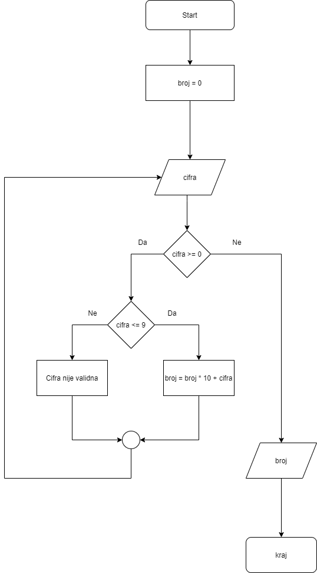

# Zadatak 01

### Analiza i specifikacije:

Input: cifra  
Output: broj

### Dizajn

| Podatak | Vrsta vrijednosti | Tip podatka | Identifikator |
| --- | --- | --- | --- |
| cifra | varijabla | int | cifra |
| broj  | varijabla | int | broj | 

### Ograničenja

cifra >= 0 i cifra <= 9

### Dijagram toka

